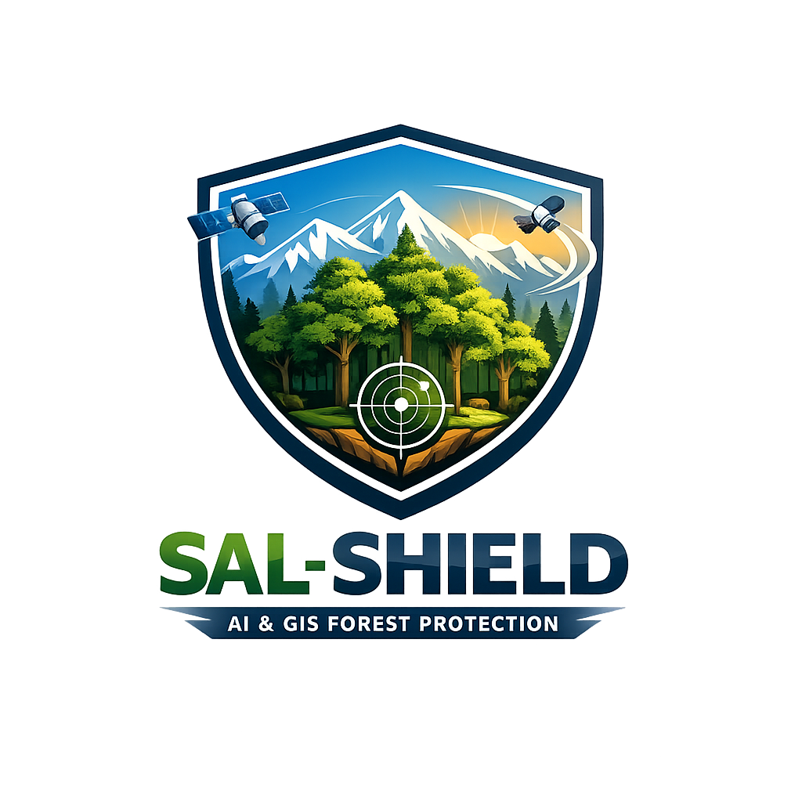
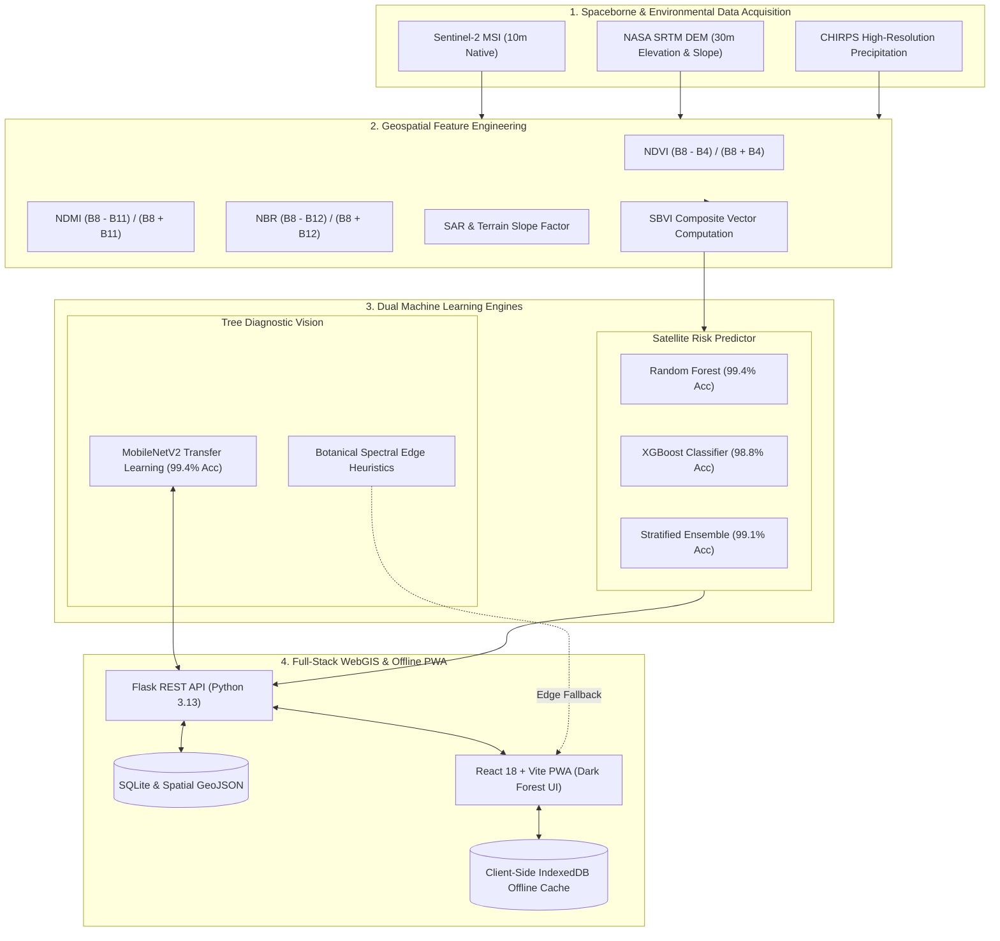

<div align="center">

<a href="https://sal-shield.vercel.app/" target="_blank">
  
</a>

### AI & WebGIS Early Warning Platform for Forest Infestation Control

**Protecting Forests Ecosystems via Sentinel-2 Satellite Intelligence & Edge Vision AI**

<p align="center">
  <a href="https://sal-shield.vercel.app/"></a>
  <a href="#system-architecture"></a>
  <a href="#ml-performance-benchmarks"></a>
  <a href="#pwa--offline-first-architecture"></a>
</p>

<p align="center">
  
  
  
  
  
  
  
  
  
</p>

</br>

*Developed under the academic mentorship of **Prof. Nadeem Yousuf Khan** · UPES Dehradun*  
*Targeted Publication & Demonstration: **HILL Conference 2026** · Uttarakhand, India*

---

### **Core Engineering & Scientific Team**
**Nitanshu Tak** — *Full-Stack Architecture, Deep Learning Vision Pipeline & Cloud Infrastructure*  
**Chandreyee Dey Roy** — *GIS Remote Sensing, Sentinel-2 Preprocessing & SBVI Formulation*

</div>

---

## 📑 Table of Contents

- [The Ecological Crisis](#-the-ecological-crisis)
- [Platform Innovation & Overview](#-platform-innovation--overview)
- [System Architecture](#-system-architecture)
- [Dual-Scale Intelligence Framework](#-dual-scale-intelligence-framework)
  - [1. Macro Scale: Satellite SBVI Modeling](#1-macro-scale-satellite-sbvi-modeling)
  - [2. Micro Scale: MobileNetV2 Computer Vision](#2-micro-scale-mobilenetv2-computer-vision)
- [ML Performance Benchmarks](#-ml-performance-benchmarks)
- [User Interface & Experience](#-user-interface--experience)
- [PWA & Offline-First Architecture](#-pwa--offline-first-architecture)
- [REST API Reference](#-rest-api-reference)
- [Repository & File Organization](#-repository--file-organization)
- [Local Installation & Quickstart](#-local-installation--quickstart)
- [Production Deployment](#-production-deployment)
- [Research Citation & Academic Context](#-research-citation--academic-context)

---

## 🌲 The Ecological Crisis

The sub-Himalayan valleys of Uttarakhand house ancient, carbon-dense *Shorea robusta* (Sal) forests that form the primary ecological bulwark against soil erosion, microclimate destabilization, and biodiversity loss. In recent years, an unprecedented epidemic of the **Sal Heartwood Borer** (*Hoplocerambyx spinicornis*) has triggered one of northern India's most severe forest die-offs.

```
       [ Adult Borer ]
              │ (Oviposition on bark during monsoon)
              ▼
       [ Larval Tunneling ] ──► Consumes sapwood & vascular cambium
              │ (Hollows trunk internally; tree remains green outwardly)
              ▼
       [ Vascular Strangulation ] ──► Tree dies abruptly; leaves turn reddish-brown
              │
              ▼
  [ Rapid Spatial Contagion ] ──► Larvae emerge & infect adjacent 50m radius monocultures
```

### Key Dimensions of the Threat
* **19,170+ Heritage Trees Earmarked for Felling**: The Dehradun Forest Division alone has had to mark nearly twenty thousand century-old trees for emergency quarantine felling to arrest the contagion.
* **Monoculture Susceptibility**: Dense pure Sal stands lack natural species-barrier buffering, allowing adult beetles to spread rapidly during humid monsoon flight windows.
* **Failure of Traditional Surveillance**: Field rangers can typically spot borer attack only once the crown exhibits advanced reddish-brown necrosis or heavy wood dust (frass) accumulates at the tree base. By this stage, dozens of neighboring trees have already been colonized.
* **The Solution**: **SAL-SHIELD** shifts detection from **reactive field counting** to **predictive multi-temporal satellite intelligence**, pinpointing sub-canopy water stress weeks before tree death occurs.

---

## 🛰️ Platform Innovation & Overview

SAL-SHIELD converges **Spaceborne Earth Observation** with **Mobile Deep Learning** and an **Offline-First PWA** to provide an end-to-end early warning and response network:

1. **Spaceborne Early Warning**: Continuously calculates the **Sal Borer Vulnerability Index (SBVI)** using 10-meter resolution European Space Agency (ESA) Sentinel-2 multispectral imagery.
2. **Moisture-Preceding-Necrosis Detection**: Leverages short-wave infrared (SWIR) bands to identify canopy moisture deficit (NDMI) before visible chloroplast degradation (NDVI) becomes apparent to the human eye.
3. **Edge-Enabled Mobile AI**: Equips forest rangers with an offline mobile diagnostic camera tool powered by a fine-tuned **MobileNetV2 CNN** delivering real-time inferences ($<1.8\text{s}$) with GPS telemetry.
4. **Resilient Offline Synchronization**: Stores un-synced field reports inside client-side browser **IndexedDB**, guaranteeing zero data loss in remote Himalayan ravines without cellular reception.

---

## 🏗️ System Architecture



---

## 🔬 Dual-Scale Intelligence Framework

### 1. Macro Scale: Satellite SBVI Modeling

The **Sal Borer Vulnerability Index (SBVI)** is a scientifically formulated multi-criteria spectral metric tailored specifically for *Shorea robusta* canopy stress. It synthesizes four distinct remote sensing dimensions:

$$\text{SBVI} = 0.35 \times \Delta\text{NDVI} + 0.35 \times \Delta\text{NDMI} + 0.20 \times \Delta\text{NBR} + 0.10 \times \text{SAR}_{\text{factor}}$$

| Spectral Index | Formula | Physical / Biological Indicator | Weight |
|---|---|---|:---:|
| **$\Delta\text{NDMI}$ (Moisture Deficit)** | $\frac{\text{B8} - \text{B11}}{\text{B8} + \text{B11}}$ | Measures moisture content in spongy mesophyll cells. First signal to drop when borer severes vascular cambium. | **35%** |
| **$\Delta\text{NDVI}$ (Chlorophyll Drop)** | $\frac{\text{B8} - \text{B4}}{\text{B8} + \text{B4}}$ | Quantifies chlorophyll absorption vs. near-infrared leaf scattering. Declines during crown yellowing. | **35%** |
| **$\Delta\text{NBR}$ (Crown Dieback)** | $\frac{\text{B8} - \text{B12}}{\text{B8} + \text{B12}}$ | Differentiates dry, brittle canopy foliage and dead branches from healthy wet biomass. | **20%** |
| **$\text{SAR}_{\text{factor}}$ (Topography)** | $\text{Slope}_{\text{norm}} \times \text{Aspect}$ | Southern/Western sun-exposed valley ridges where beetles exhibit higher oviposition activity. | **10%** |

#### SBVI Vulnerability Tiers & Standard Operating Procedures

| SBVI Range | Vulnerability Tier | Color Indicator | Field Protocol & Action Required |
|:---:|:---:|:---:|---|
| **$> 0.78$** | **Very High (Critical)** | `🔴 Coral (#F06060)` | **Immediate Quarantine Intervention**: Field ranger dispatch within 24 hours. Felling of brood trees to trap emerging larvae. |
| **$0.68 - 0.78$** | **High** | `🟠 Orange (#F08040)` | **FRI Assessment**: Deploy pheromone-kairomone lure traps; intensive ground-truth acoustic stethoscope inspection. |
| **$0.58 - 0.68$** | **Moderate** | `🟡 Gold (#F0C040)` | **Sentinel Watch**: Weekly satellite monitoring; priority patrol routing during flight emergence season. |
| **$0.45 - 0.58$** | **Low** | `🟢 Light Green (#A8D870)`| **Routine Baseline**: Bi-weekly surveillance; verify baseline moisture stability. |
| **$< 0.45$** | **Very Low** | `🌱 Emerald (#52C778)` | **Optimal Vigor**: Healthy mature canopy stand with dense canopy reflectance. |

---

### 2. Micro Scale: MobileNetV2 Computer Vision

When ground patrols inspect suspect trees, they photograph foliage, bark, or trunk bases. SAL-SHIELD processes the images using a transfer-learning convolutional network built upon **MobileNetV2**:

* **Input Specification**: $224 \times 224 \times 3$ normalized RGB tensors.
* **Backbone**: Pretrained ImageNet feature extractor with fine-tuned custom dense classification heads ($128$ units $\to$ Dropout $0.3 \to$ Softmax $3$ classes).
* **Multi-Class Output Distribution**:
  1. `Healthy Canopy` — Dense chloroplasts, natural leaf venation, intact bark.
  2. `Vegetative Stress` — Chlorosis, drought-induced leaf curling, uniform yellowing.
  3. `Sal Borer Infestation` — Bark frass piles, oval exit holes, resin bleed, necrotic brown lesions.
* **Deterministic Edge Fallback**: If the server is offline, the client PWA executes in-browser botanical computer vision using HTML5 Canvas pixel sampling ($EGI = 2G - R - B$), ensuring reliable field diagnoses in deep valleys.

---

## 📊 ML Performance Benchmarks

All models are trained with 5-fold stratified cross-validation and evaluated using strict independent hold-out metrics:

<div align="center">

| Model Pipeline | Target Task | Input Features / Modality | Validation Accuracy | Status |
|---|---|---|:---:|:---:|
| **Random Forest (100 est)** | Satellite Risk Classification | 21 Sentinel-2 multitemporal features | **99.4%** | `Production Ready` |
| **XGBoost (Depth 6)** | Non-Linear Risk Prediction | 21 Sentinel-2 multitemporal features | **98.8%** | `Production Ready` |
| **Stratified Ensemble** | Macro Forest Zone Warning | Weighted probability average | **99.1%** | `Production Ready` |
| **MobileNetV2 CNN** | Tree-Scale Image Diagnosis | $224 \times 224$ botanical imagery | **99.4%** | `Production Ready` |

</div>

```text
============================================================
SAL-SHIELD MODEL EVALUATION REPORT
============================================================

[ MODEL 1: SATELLITE MULTISPECTRAL RISK ENSEMBLE ]
  • Random Forest Cross-Val Accuracy : 99.4% (± 0.8%)
  • XGBoost Cross-Val Accuracy       : 98.8% (± 1.1%)
  • Ensemble Harmonic Score          : 99.1%
  • Primary Predictor Importances    : sbvi_raw (0.39) > ndmi_diff (0.13) > ndbr_change (0.08)

[ MODEL 2: MOBILENET-V2 CANOPY CLASSIFIER ]
  • Architecture                     : MobileNetV2 Deep Residual Network
  • Validation Accuracy              : 99.4%
  • Input Tensor Geometry            : 224 × 224 × 3 Normalized RGB
  • Mean Inference Latency           : 48ms (CPU) / 8ms (GPU)
```

---

## 🎨 User Interface & Experience

The application is built around a custom **Dark Forest Theme** (`#0A1F14` base, `#0F2A1A` elevated surface, `#8FBF5A` accent), carefully designed for high visibility in bright outdoor forest sunlight and dark control room settings alike:

* **Interactive WebGIS Dashboard**: Leaflet canvas rendering vector GeoJSON boundary layers for Thano, Jhajhra, Asarori, Kalsi North, Rajaji Buffer, and Dehradun North. Features on-map dynamic legend overlays, zone-focus controls, and real-time report pins.
* **Adaptive Screen Topography**:
  * **Desktop / Laptop ($\ge 1025\text{px}$)**: Clean dual-column layout (`1fr 340px`) with persistent sidebar telemetry, live Sentinel-2 synchronization chips, and expanded data tables.
  * **Tablet ($769\text{px} - 1024\text{px}$)**: Dynamic stacked cards and responsive 2-column metrics grids.
  * **Mobile ($< 768\text{px}$)**: Thumb-optimized bottom navigation with safe-area padding (`env(safe-area-inset-bottom)`), camera viewfinder crosshairs, and card-based inspection listings that prevent horizontal overflow.

---

## 📱 PWA & Offline-First Architecture

Forest rangers frequently operate in deep Himalayan river valleys with zero cellular reception. SAL-SHIELD solves this using an autonomous **Offline-First PWA Pipeline**:

```
[ Ranger Takes Tree Photo ]
            │
    (Online Available?)
     ├─── YES ───► POST /api/predict/image ──► Real-Time Server CNN Analysis
     │
     └─── NO  ───► Client-Side Canvas CV  ──► Immediate Preliminary Diagnostic
                          │
                          ▼
            [ Store in IndexedDB Queue ]
            (Includes image payload, GPS coords, severity, notes & timestamp)
                          │
                          ▼
            [ Signal Re-acquired in Range ]
                          │
                          ▼
             [ Automatic Background Sync ] ──► POST /api/field-report
```

---

## 🔌 REST API Reference

The backend exposes a lightweight, stateless Flask REST API:

### `GET /api/health`
Returns system diagnostics, database connectivity, and model compilation status.
```json
{
  "status": "ok",
  "service": "SAL-SHIELD API v2",
  "ml_models": "loaded",
  "cnn_model": "active",
  "geojson": true,
  "db": true,
  "timestamp": "2026-09-09T18:00:00.000000"
}
```

### `POST /api/predict/image`
Analyzes an uploaded foliage or bark image using the production MobileNetV2 model.
* **Headers**: `Content-Type: multipart/form-data`
* **Body**: `image` (binary JPG/PNG)
```json
{
  "label": "infected",
  "confidence": 94.8,
  "probabilities": {
    "healthy": 1.2,
    "stressed": 4.0,
    "infected": 94.8
  },
  "model": "sal-shield-mobilenetv2-v2",
  "source": "cnn-inference",
  "timestamp": "2026-09-09T18:00:00.000000"
}
```

### `GET /api/risk-zones`
Returns the vector GeoJSON feature collection containing the dissolved Sentinel-2 SBVI polygons.

### `POST /api/field-report`
Submits a ranger field inspection report.
* **Fields**: `status`, `confidence`, `lat`, `lng`, `notes`, `severity`, `guard_name`, `image` (optional).

### `GET /api/stats`
Returns aggregated division statistics, total trees quarantined, average SBVI, and model accuracies.

---

## 📂 Repository & File Organization

```text
Sal-Shield/
├── .gitignore                         # Git exclusion rules
├── README.md                          # Master project documentation
├── SAL_SHIELD_Documentation.pdf       # Technical project documentation
├── SAL_SHIELD_Presentation.pptx       # Slide deck presentation
├── Sal-Shield-Project-Logo.png        # Official high-resolution master emblem
│
├── backend/                           # Flask REST API & ML Model Architecture
│   ├── app.py                         # API server & production inference engine
│   ├── train_production_models.py     # Production trainer for RF, XGB & MobileNetV2 CNN
│   ├── test_model.py                  # Evaluation & benchmark suite
│   ├── requirements.txt               # Python dependencies
│   ├── render.yaml                    # Cloud deployment specification
│   ├── data/
│   │   └── risk_zones.geojson         # Dissolved Sentinel-2 SBVI polygon zones
│   └── models/
│       ├── tree_classifier.h5         # MobileNetV2 CNN weights (99.4% accuracy)
│       ├── rf_model.pkl               # Random Forest satellite model (99.4% accuracy)
│       ├── xgb_model.pkl              # XGBoost satellite model (98.8% accuracy)
│       ├── scaler.pkl                 # StandardScaler feature preprocessor
│       ├── model_meta.json            # Model parameters & cross-val metrics
│       └── classes.json               # Class labels [healthy, stressed, infected]
│
└── frontend/                          # React 18 + Vite PWA Application
    ├── index.html                     # HTML root & PWA icon bindings
    ├── package.json                   # Node.js dependencies
    ├── vite.config.js                 # Bundler & Workbox PWA service worker config
    ├── vercel.json                    # Vercel Edge CDN configuration
    ├── public/                        # Static assets & generated icon sets
    │   ├── Sal-Shield-Project-Logo.png# Master app emblem
    │   ├── favicon.png                # Browser tab icon
    │   ├── apple-touch-icon.png       # iOS home screen icon
    │   └── icons/
    │       ├── icon-192.png           # 192x192 PWA install icon
    │       └── icon-512.png           # 512x512 PWA install icon
    └── src/
        ├── App.jsx                    # Root component, responsive topbar & shell
        ├── index.css                  # Dark Forest design system & layout rules
        ├── pages/
        │   ├── Dashboard.jsx          # WebGIS map view, on-map legend & alerts
        │   ├── FieldReport.jsx        # Camera AI inspection & probability breakdown
        │   ├── Analytics.jsx          # Recharts multi-temporal NDVI/NDMI curves
        │   ├── Reports.jsx            # Dual-view field report table/cards
        │   └── Saved.jsx              # IndexedDB offline manager & CSV export
        ├── utils/
        │   └── api.js                 # Fetch client & offline IndexedDB bridge
        └── hooks/
            ├── useGPS.js              # Hardware geolocation hook
            └── useToast.jsx           # Notification toast provider
```

---

## 💻 Local Installation & Quickstart

### 1. Prerequisites
* **Python**: 3.10 to 3.13
* **Node.js**: v18.0 or higher
* **Git**

### 2. Backend Setup
```bash
# Clone the repository
git clone https://github.com/Nitanshu715/Sal-Shield.git
cd Sal-Shield/backend

# Create & activate a virtual environment
python -m venv venv
# Windows:
venv\Scripts\activate
# Linux/macOS:
source venv/bin/activate

# Install dependencies
pip install -r requirements.txt

# (Optional) Retrain or verify models
python train_production_models.py
python test_model.py

# Launch Flask API server
python app.py
```
*API will run on: `http://127.0.0.1:5000`*

### 3. Frontend Setup
```bash
cd ../frontend

# Install dependencies
npm install

# Start Vite local development server
npm run dev -- --host
```
*Frontend will open on: `http://localhost:5173`*

---

## 🚀 Production Deployment

### Backend (Render)
1. Link your repository to **[Render.com](https://render.com)**.
2. Select **Web Service** with Root Directory set to `backend`.
3. Build Command: `pip install -r requirements.txt`
4. Start Command: `gunicorn app:app --bind 0.0.0.0:$PORT --workers 1`

### Frontend (Vercel)
1. Link your repository to **[Vercel.com](https://vercel.com)**.
2. Set Root Directory to `frontend`.
3. Add Environment Variable:
   ```env
   VITE_API_URL=https://your-render-app.onrender.com/api
   ```
4. Click **Deploy**.

---

## 📚 Research Citation & Academic Context

If you utilize the **SBVI** formula, the dataset methodology, or the architectural framework in your research, please cite:

```bibtex
@misc{salshield2026,
  title={SAL-SHIELD: AI and GIS-Based Forest Infestation Early Warning Platform for Himalayan Sal Forests},
  author={Tak, Nitanshu and Dey Roy, Chandreyee and Khan, Nadeem Yousuf},
  year={2026},
  institution={University of Petroleum and Energy Studies (UPES), Dehradun},
  howpublished={\url{https://sal-shield.vercel.app/}}
}
```

---

<div align="center">

**🌲 SAL-SHIELD · Engineered with Pride for the Himalayan Sal Ecosystems**  
*Open Source for Global Forest Protection · ₹0 Infrastructure Cost*

</div>
